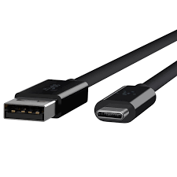
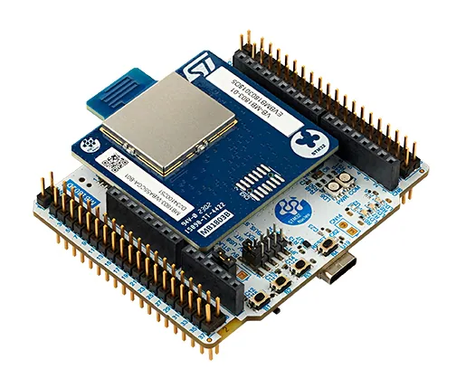

----!
Presentation
----!

# Introduction
## Dear STM32WBA MOOC participant,
<br>

Welcome to our comprehensive guide for  STM32WBA55 MOOC. This step-by-step guide is designed to provide you with all the necessary information about the prerequisites, installation process, and links to materials that will be useful during this MOOC.

In this guide, you will find detailed information about the required software and hardware, as well as a brief overview of the installation process. Additionally, we have included links to materials that will be helpful during the session.


In the appendix, you will find some basic information about the board that we will be using during the session, as well as useful information about the configuration and usage of the STM32CubeIDE.
<br>

To navigate through this guide, please use the navigation buttons provided.
<br>

  

<br>


## Yours,
## STMicroelectronics 
<br>

# Prerequisites
- Hardware:
  - PC with MS Windows 10 operating system (preferred) and admin rights granted
  - 1 USB Type-C cable
  - Smartphone
  <br>
  
  <br>
  - **[NUCLEO-WBA55CG](https://www.st.com/en/evaluation-tools/nucleo-wba55cg.html)** Nucleo-64 development board. <br>(For in-person technical workshops the board will be provided by ST on the spot.)
  <br>
  
  <br>
- Software:
  - **[Workshop Package](https://drive.google.com/file/d/1xP8wb-lbPSRSwxUzYoTjcddb1SjvHoRr/view?usp=sharing)** 
  - **[STM32CubeIDE](https://www.st.com/en/development-tools/stm32cubeide.html)** v1.16.0
  	-  **Warning:** All attendees must install the exact specified version of the IDE for the workshop.
   -  [STM32CubeIDE v1.16.0 Win x86_64 installer](https://drive.google.com/file/d/1EjO7UWWVZMysyf1Zk0Wh-4qY7Y6uGzzo/view?usp=sharing)
  - **[STM32CubeWBA Firmware Package](https://rristm.github.io/tomas_materials_v2/stm32ws2023/STM32WBA_WS/master/file_live_1.md/2)** v1.4.0
  	- **Warning:** All attendees must install the exact specified version of the STM32CubeWBA firmware package for the workshop.
   - The package must be downloaded directly through the STM32CubeIDE , under Help->Manage Embedded Software Packages<br> **[See next slide for procedure](https://rristm.github.io/tomas_materials_v2/stm32ws2023/STM32WBA_WS/master/file_live_1.md/2)**
  - **[STM32CubeProgrammer](https://www.st.com/en/development-tools/stm32cubeprog.html)** v2.17.0
  <!-- - **[CubeMx .ioc project template](https://github.com/stm32ws2023/WBA_WS_ioc)** we will use it during hands-on -->
  <!-- - **[Virtual COM port drivers](https://www.st.com/en/development-tools/stsw-stm32102.html)** -->
  -  Any serial terminal emulator application (e.g. **[Termite](https://termite.software.informer.com/3.4/)** or **[TeraTerm](https://teratermproject.github.io/index-en.html)**)
  - ST BLE Toolbox smartphone app - this has to be downloaded via App Store or Google Play Store on your smartphone
    - **[Android version](https://play.google.com/store/apps/details?id=com.st.dit.stbletoolbox&hl=it&gl=US&pli=1)**
    <br>
    
    <br>
    - **[IOS version](https://apps.apple.com/it/app/st-ble-toolbox/id1531295550)**
    <br>
    
    <br>

<br>

# Installation process
- Download **STM32CubeIDE** from [here](https://www.st.com/en/development-tools/stm32cubeide.html)
	- Please make sure to select the version 1.16.0 (not the latest one).
- Install **STM32CubeIDE**
- Download and install **STM32CubeWBA Firmware Package**:
  - Run STM32CubeIDE
  - Go to `Help -> Manage Embedded Software Packages`
  - In the Embedded Software Packages Manager window, find the STM32WBA series, expand it, and check the checkbox for the version v1.4.0
  - Press `Install `
<br>


<br>
----


# Verification process before the workshop
The purpose of this part is checking whether all software components are installed properly.
<br>
Additionally prepared test project can be a base for next hands-on parts during the workshop.

## **STM32CubeIDE and STM32WBA Cube library**
<br>

----

<br>
**Task definition**
<br>

- Using STM32CubeIDE
  - Enable SWD for debug
  - Disable TrustZone
  - Configure ICACHE (in any of available modes)
- Select and configure USART1
  - in asynchronous mode,
  - using default settings (115200bps, 8D, 1stop bit, no parity) 
  - on PA8/PB12 pins
<br>

----

<br>
## **Step1** - project creation and peripherals configuration
 - Run **STM32CubeIDE**
 - Specify workspace location (i.e. `C:\_Work\WBA_ex1`)
<br>
- In **Window** -> **Preferences** -> **STM32Cube**  -> **Firmware Updater** Select ** Manual Check **

  
<br>
- Start new project using one of the below methods:
  - by selecting `File->New->STM32Project` 
  - by click on `Start new STM32 project` button
  <br>
  
<br>
- switch to **Board Selector** tab
- select **NUCLEO-WBA52CG** board
- press `Next` button
- within STM32 Project window:
  - specify project name (i.e. `WBA_UART`)
  - keep **enable TrustZone** option unchecked
  - press `Finish` button
  - on question pop-up window "Initialize all peripherals with their default state?" press `No` button 
  - on question pop-up window "Switch to proper CubeIDE perspective?", if it is showed, press `Yes` button 
  - on worning pop-up window "Do you still want a code generation?", press `No` button 
  - on following information pop-up window, it was our decision did not generate code, press `OK` button 
  <br>
   
<br>
- Peripherals configuration: Pinout&Configuration tab
- **ICACHE configuration** (System Core group)
  - select either 1-way or 2-ways (we will not focus on performance within this workshop)
  <br>
  
  <br>
- **USART1 configuration** (Connectivity group)
  - select Asynchronous mode
  - keep default settings in configuration:
    - Basic parameters: 115200bps, 8bits data, 1 stop bit, no parity
    - Pins assignment: PA8, PB12
    - no interrupts, no DMA usage
  <br>
    
<br>
- **Project settings**
  - select `Project Manager` tab
  - check project location (.ioc file)
  - check project name
<br>
   
<br>
  - generate project by one of the ways:
    - by pressing "gear" icon
    - by select `Project->Generate Code`
    - by pressing **Alt+K**

----

<br>
## **Step2** - coding part (`main.c` file)
<br>
Define the buffer of bytes to be sent over **USART1** (`USER CODE PV` section):
<br>

```c
  uint8_t buffer[]={"Hello STM32WBA\r\n"};
```

<br>
Turn on **LED1_GREEN** (`USER CODE 2` section):
<br>

```c
    HAL_GPIO_WritePin(LD1_GPIO_Port, LD1_Pin, 1);
```

<br>
Toggle **LED1_GREEN** (`USER CODE 3` section)
<br>
Toggle **LED2_YELLOW** 
<br>
Start transmit of the data over **USART3** using prepared buffer and ***polling*** method
<br>
Wait for 250 ms
<br>

```c
 HAL_GPIO_TogglePin(LD1_GPIO_Port, LD1_Pin);
	  HAL_GPIO_TogglePin(LD2_GPIO_Port, LD2_Pin);
	  HAL_GPIO_TogglePin(LD3_GPIO_Port, LD3_Pin);
	  HAL_UART_Transmit(&huart1, buffer, 15, 200);
	  HAL_Delay(250);
```

<br>

<br>

----

<br>
## **Step 3** - build the project
- Build the project using `hammer` button or `Project->Built All` or **Ctrl+B**
<br>

<br>

<ainfo>
In case of neither errors nor warnings after this process, STM32CubeIDE and STM32WBA library are installed correctly.
</ainfo>


<ainfo>
## **Congratulations** You have completed installation part. Now you are fully prepared for the live workshop session. 
</ainfo>

----

# Materials for the session
- Access to tools dedicated web pages:
  - [STM32CubeIDE](https://www.st.com/en/development-tools/stm32cubeide.html)
  - [STM32CubeMX](https://www.st.com/en/development-tools/stm32cubemx.html)
  - [STM32WBA Cube library](https://www.st.com/en/embedded-software/stm32cubewba.html)
- [STM32 on-line training resources](https://www.st.com/content/st_com/en/support/learning/stm32-education/stm32-moocs.html)
- documentation
  - [STM32WBA55xx datasheet](https://www.st.com/resource/en/datasheet/stm32wba55cg.pdf)
  - [STM32WBA55xx reference manual](https://www.st.com/resource/en/reference_manual/rm0493-multiprotocol-wireless-bluetooth-lowenergy-armbased-32bit-mcu-stmicroelectronics.pdf)


